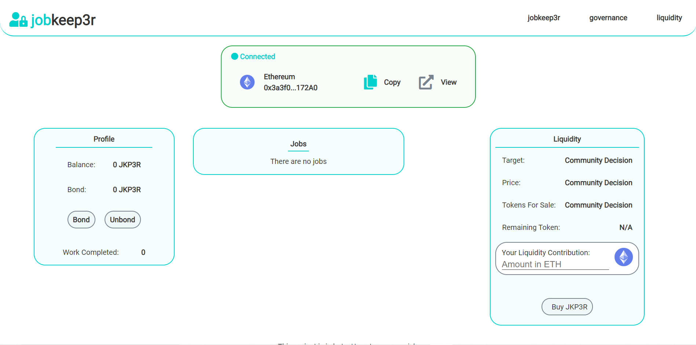

# Jobkeep3r.network

# Introduction:

Jobkeep3r Network is designed as a decentralized coordination ecosystem for projects to find Keepers that will help with their upkeep.

<!--  -->

# What are Jobs?

There are various kinds of job in the jobkeep3r network:-

1. Smart Contract- A Job is the term used to refer to a smart contract that wishes an external entity to perform an action. They would like the action to be performed in “good will” and not have a malicious result. For this reason they register as a job, and keepers can then execute on their contract.

2. An idea of the smart contract- If some entity has an idea what needs to be build but unable to do so on their own basis. So, they can post an idea as a ‘job’ and if some keeper finds it interesting they can execute the idea. For this an entity needs to clear and specific what they want to be done.

3. An audit of a contract- external entities can post the smart contract for audit as a ‘job’. Keeper will do a thorough analysis of the contract and then will present the report.

4. A cooperation among similar minded individual for a new smart contract based project posted as a ‘job’.

# What is keeper?

A Keeper is the term used to refer to an external person and/or team that executes a job. This can be as simplistic as calling a transaction, or as complex as requiring extensive off-chain logic. The scope of jobkeep3r network is not to manage these jobs themselves, but to allow contracts to register as jobs for keepers, and keepers to register themselves as available to perform jobs. It is up to the individual keeper to set up their devops and infrastructure and create their own rules based on what transactions they deem profitable.

# Why Jobkeep3r?

A simple and easy to understand project to participate in the growth of blockchain sector especially Defi sector.

More information about the jobkeep3r will be out soon. Keep an eye on this space to be updated.

Social media:

[Telegram- https://t.me/jobkeep3r](https://t.me/jobkeep3r)

[Announcement- https://t.me/jobkeep3rv1](https://t.me/jobkeep3rv1)

[Twitter- https://twitter.com/jobkeep3r](https://twitter.com/jobkeep3r)

[Medium- https://medium.com/jobkeep3r](https://medium.com/jobkeep3r)
